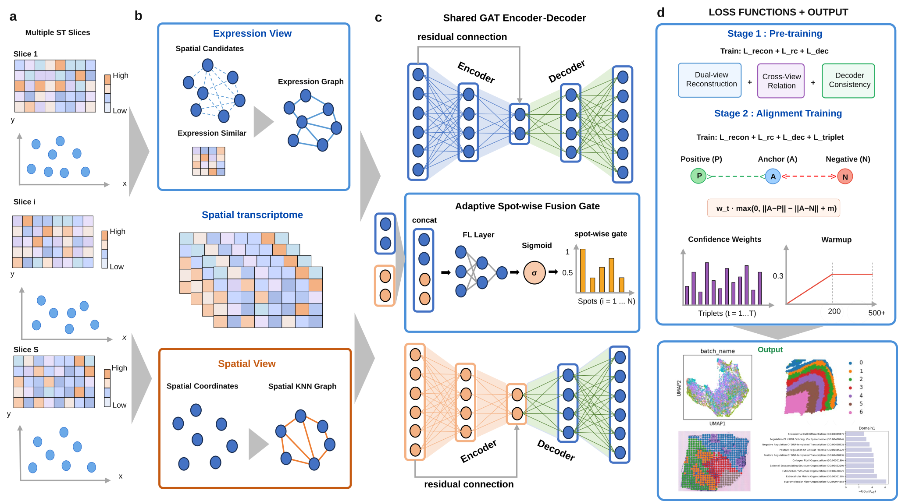

# DVCAlign

DVCAlign is a Python package for alignment and integration of spatial transcriptomics data across slices, conditions, platforms, and developmental stages.

## Repository

- GitHub: https://github.com/VitaIntelli-CQU/DVCAlign
- Author: Cheng Wei
- Contact: 2804775192@qq.com

## Data Sources

The experiments in this project use public spatial transcriptomics datasets from the following official or author-maintained sources:

1. Human DLPFC (adjacent sections 151673-151676)
   - spatialLIBD project: https://research.libd.org/spatialLIBD/
   - data access helper: https://research.libd.org/spatialLIBD/reference/fetch_data.html

2. Mouse brain sagittal sections with partial overlap
   - 10x Genomics Visium, Sagittal Anterior:
     https://www.10xgenomics.com/datasets/mouse-brain-serial-section-2-sagittal-anterior-1-standard
   - 10x Genomics Visium, Sagittal Posterior:
     https://www.10xgenomics.com/datasets/mouse-brain-serial-section-2-sagittal-posterior-1-standard

3. HER2-positive human breast cancer sections
   - author-maintained project repository (HER2ST):
     https://github.com/almaan/her2st
   - processed dataset archive (Zenodo):
     https://zenodo.org/records/4751624

4. Developmental human embryonic heart series (4.5-5 PCW and 6.5 PCW)
   - image, coordinate, and transformation files (Mendeley Data):
     https://data.mendeley.com/datasets/dgnysc3zn5/1
   - sequencing dataset record (EGA):
     https://ega-archive.org/datasets/EGAD00001005468

## Official Documentation

- spatialLIBD documentation: https://research.libd.org/spatialLIBD/
- 10x Genomics dataset documentation: https://www.10xgenomics.com/datasets
- HER2ST project documentation: https://github.com/almaan/her2st
- Mendeley Data record for the developmental human heart dataset: https://data.mendeley.com/datasets/dgnysc3zn5/1

## Demo Notebook

A runnable DLPFC example notebook is included in this repository:

- [DLPFC demo notebook](examples/DLPFC.ipynb)

A runnable mouse-brain partial-overlap example is also included:

- [MB2SAP demo notebook](examples/MB2SAP.ipynb)

The MB2SAP notebook uses the `mMAMP` data layout, with two Visium sections:
`MA` (10x Genomics Mouse Brain Serial Section 2, Sagittal Anterior) and `MP`
(10x Genomics Mouse Brain Serial Section 2, Sagittal Posterior). The official
source pages are the [Sagittal Anterior dataset](https://www.10xgenomics.com/datasets/mouse-brain-serial-section-2-sagittal-anterior-1-standard)
and the [Sagittal Posterior dataset](https://www.10xgenomics.com/datasets/mouse-brain-serial-section-2-sagittal-posterior-1-standard).
The expression and ground-truth files are not bundled; place them under
`DVCAlign/Data/mMAMP/MA` and `DVCAlign/Data/mMAMP/MP` using the layout expected
by the notebook.

This notebook demonstrates a typical DVCAlign workflow for adjacent DLPFC sections, including:

1. environment setup
2. slice preparation and spatial graph construction
3. training configuration
4. representation learning
5. domain evaluation and visualization
6. cross-slice alignment analysis
7. export of embeddings and results

## Contents

This repository currently includes:

- the core package code in `DVCAlign/`
- dependency files for Linux and macOS
- packaging metadata in `setup.py`
- example notebooks in `examples/`

Large datasets are not bundled in the repository.

## Installation

Create a clean Python environment first:

```bash
conda create -n env_DVCAlign python=3.8
conda activate env_DVCAlign
```

Install dependencies:

```bash
pip install -r requirement.txt
```

For macOS:

```bash
pip install -r requirement_for_macOS.txt
```

Then install the package itself:

```bash
pip install -e .
```

## Notes

- `mclust_R` requires both `rpy2` in Python and the R package `mclust`.
- `torch-geometric`, `torch-scatter`, `torch-sparse`, and `torch-cluster` must match your local PyTorch environment.

## Minimal Usage

```python
import DVCAlign

DVCAlign.Cal_Spatial_Net(adata, rad_cutoff=150)
adata = DVCAlign.train_DVCAlign(adata, verbose=True)
adata = DVCAlign.mclust_R(adata, num_cluster=7, used_obsm="DVCAlign")
```

## Citation

If this repository supports your research, please cite:

Cheng Wei. DVCAlign. GitHub repository. https://github.com/VitaIntelli-CQU/DVCAlign
